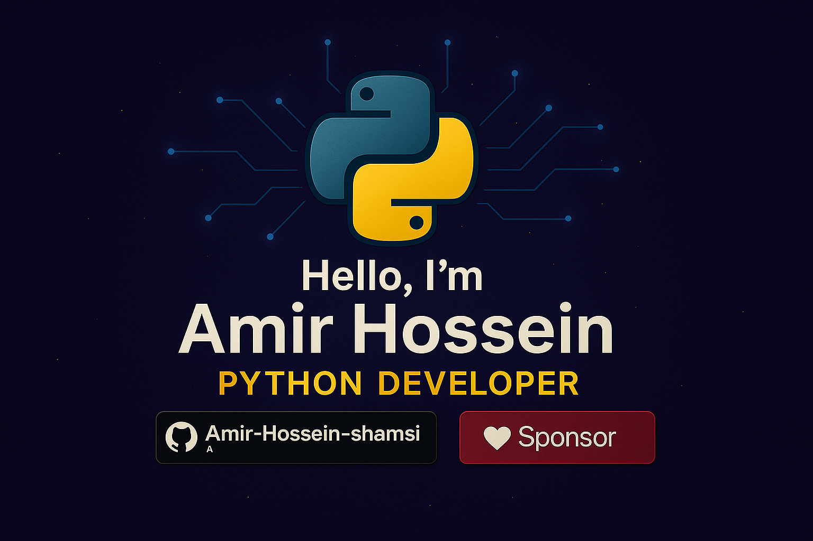

  

<h1 align="center">Hi there, I'm Amir Hossein Shamsi 👨‍💻</h1>
<h3 align="center">Python Developer | Backend Engineer | ML Enthusiast</h3>

  Passionate about building scalable backends, data-driven applications, and intelligent automation tools.
  I thrive on optimizing performance, crafting clean architectures, and contributing to open-source ecosystems.

---

### 🚀 Currently Building
- **LLM-based Chatbots** with LangChain & OpenAI
- **Retrieval-Augmented Generation (RAG)** systems for intelligent search

### 🌱 Learning & Exploring
- Deep learning frameworks (PyTorch, TensorFlow)
- Vector databases (Pinecone, FAISS)
- Container orchestration with Kubernetes & Docker

### 💬 Ask Me About
`Flask` • `FastAPI` • `Async Python` • `RAG Pipelines` • `Prompt Engineering`

---

## 🔥 Featured LLM Projects

### 🤖 ChatFlux
> A custom conversational agent powered by LangChain and OpenAI embeddings.

### 📚 DocRetriever
> Document search API integrating Elasticsearch and Pinecone for semantic retrieval.

---

## 📫 Let's Connect
📧 **Email:** [shamsiamirhossein1@gmail.com](mailto:shamsiamirhossein1@gmail.com)

---

## 📊 GitHub Stats

  

  

---

## 🧠 Core ML Stack

  
  
  
  

## 🧰 Data Tools

  
  
  

## 🛠️ Tech Stack Wizardry

  
  
  
  
  
  
  

