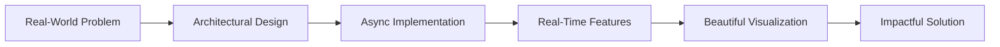

# 👋 Hello,I'm AmirHossein Shamsi

**AI Engineer & Python Developer**  

## 🚀 About Me

I'm a passionate developer with expertise in building **real-time systems, AI-powered applications, and geospatial solutions**.

> *"I don't just write code—I architect experiences that solve real-world problems."*

---

## 🛠️ Technical Arsenal

### 🤖 **Artificial Intelligence**


### 🌐 **Web Development**


### 🗺️ **Geospatial & Visualization**


### 🗃️ **Databases & Infrastructure**


---

## 🌟 Featured Projects

### 🚚 [Real-Time Geo-Tracking Application](https://github.com/Amir-Hossein-shamsi/Real-Time-Geo-Tracking-Application)
**Live package tracking with dynamic routing and WebSocket communication**

```python
# Architecture: FastAPI + MongoDB + Redis + Folium + OSRM
```
- Implemented real-time location updates using WebSockets and Redis Pub/Sub
- Developed intelligent route optimization with dynamic waypoint insertion
- Created interactive map visualizations with live animation

### 🥑 [VitaGuide Nutrition Assistant](https://github.com/Amir-Hossein-shamsi/vitaguide)
**AI-powered nutrition guidance backed by scientific articles**

```python
# Technology: RAG + GPT-4 + Pinecone + Streamlit
```
- Built Retrieval-Augmented Generation system processing 1,367+ nutrition articles
- Engineered content ingestion pipeline from FitDay.com with fair use compliance
- Designed intuitive UI for evidence-based dietary recommendations

### 🗺️ [TehranNavigator](https://github.com/Amir-Hossein-shamsi/TehranNavigator)
**Interactive route planning using real street network data**

```python
# Stack: OSMnx + NetworkX + ipyleaflet + geopy
```
- Implemented geocoding and shortest-path algorithms for Tehran's road network
- Created interactive Jupyter widgets for seamless user experience
- Visualized optimal routes with custom markers and path styling

### ❄️ [Icebreaker AI](https://github.com/Amir-Hossein-shamsi/icebreaker)
**AI-powered profile summarization from social media data**

```python
# Framework: LangChain + Groq API + Custom Agents
```
- Developed multi-platform scraping agents for LinkedIn and Twitter
- Designed modular architecture for easy extension to new platforms
- Implemented AI-generated professional summaries and fun facts

---

## 📊 Development Philosophy


```mermaid
graph LR
    A[Real-World Problem] --> B[Architectural Design]
    B --> C[Async Implementation]
    C --> D[Real-Time Features]
    D --> E[Beautiful Visualization]
    E --> F[Impactful Solution]
```

I believe in building systems that are:
- **🔧 Robust**: Error-resistant with proper logging and monitoring
- **⚡ Efficient**: Optimized performance with async/await patterns  
- **🎨 User-Centric**: Intuitive interfaces with meaningful visualizations
- **📈 Scalable**: Designed for growth with modular architecture

---

## 📫 Let's Connect!

I'm always open to discussing new projects, creative ideas, or opportunities to be part of your vision.

[](mailto:shamsiamirhossein1@gmail.com)
---
> "Code is poetry—every line should have purpose, every function should tell a story,  
> and every system should solve a problem worth solving."

*Built with ❤️ and 🐍 Python*
