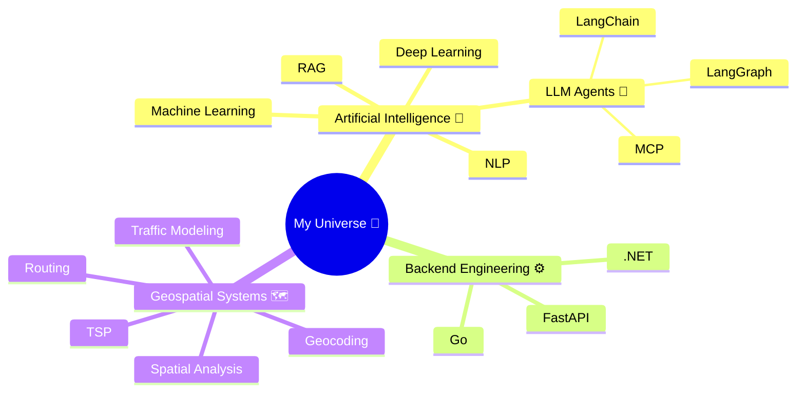
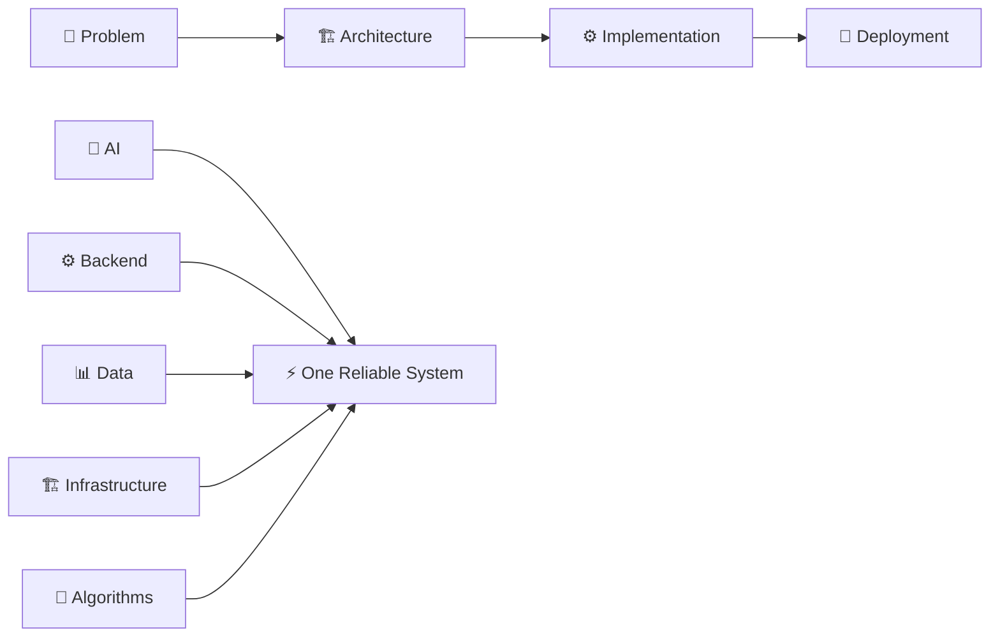

<!-- ══════════════════════════ HEADER ══════════════════════════ -->


<!-- ⌨️ Typing animation -->
<p align="center">
  
</p>

<!-- 🔢 Live profile badges -->
<p align="center">
  
  <a href="https://github.com/Amir-Hossein-shamsi?tab=followers">
    
  </a>
</p>

---

<!-- ══════════════════════════ ABOUT ══════════════════════════ -->
## 👨‍💻 About Me

```bash
$ whoami
amirhossein-shamsi

$ cat ~/profile.json
{
  "name":     "AmirHossein Shamsi",
  "role":     ["AI Engineer", "Backend Engineer"],
  "focus":    ["LLM Agents", "MCP", "Geospatial Intelligence"],
  "building": "AI-powered backends · routing engines · search systems",
  "tools":    ["Python", "FastAPI", ".NET", "Go", "PyTorch"],
  "motto":    "AI + Backend + Data + Infrastructure = One Reliable System"
}

$ sudo make impact
▸ training models............ done ✓
▸ deploying systems.......... done ✓
▸ solving real problems...... always ✓
```

I build **AI-powered applications, backend services, and intelligent geospatial systems** — with a strong focus on practical engineering, system architecture, and real-world problem solving.

---

<!-- ══════════════════════════ TECH STACK ══════════════════════════ -->
## 🧰 Tech Stack

<p align="center">
  
</p>

<details>
<summary>🎯 <b>Full Arsenal & Matrix — click to expand</b></summary>

<br>

### Languages

<p>
  
  
  
</p>

### AI & Machine Learning

<p>
  
  
  
  
  
  
</p>

### Backend & APIs

<p>
  
  
  
  
</p>

### Data & Infrastructure

<p>
  
  
  
  
  
  
</p>

### Geospatial & Routing

<p>
  
  
  
  
  
  
</p>

<br>

### 🌐 The Full Matrix

| Area | Technologies |
|------|--------------|
| 🤖 **AI / ML** | PyTorch · Scikit-learn · NLP · Deep Learning · RAG |
| 🧠 **LLM & Agents** | LangChain · LangGraph · MCP · AI Agents · OpenAI |
| 🐍 **Backend** | Python · FastAPI · AsyncIO · REST APIs · WebSockets |
| 💻 **Enterprise Backend** | .NET · Django · FastAPI |
| 🗺️ **Geospatial** | OpenStreetMap · OSRM · GeoPandas · OSMnx · NetworkX · MapLibre |
| 🚚 **Routing & Optimization** | TSP · Route Optimization · Traffic Modeling |
| 🔎 **Search & Data** | Elasticsearch · MongoDB · Redis · Vector Search |
| 🐹 **Other Languages** | Go · C# |
| 🐳 **Infrastructure** | Docker · Linux · Git · CI/CD |
| 📱 **Development** | REST · GraphQL · WebSockets · Microservices |

</details>

---

<!-- ══════════════════════════ INTERESTS ══════════════════════════ -->
## 🧠 Areas of Interest


```mermaid
mindmap
  root((My Universe 🚀))
    Artificial Intelligence 🤖
      Machine Learning
      Deep Learning
      NLP
      RAG
      LLM Agents 🧠
        LangChain
        LangGraph
        MCP
    Backend Engineering ⚙️
      FastAPI
      .NET
      Go
    Geospatial Systems 🗺️
      Geocoding
      Routing
      TSP
      Traffic Modeling
      Spatial Analysis
```

---

<!-- ══════════════════════════ BUILDING ══════════════════════════ -->
## 🔥 What I Love Building

<p align="center">
  
  
  
  
  <br/>
  
  
  
  
  
</p>

---

<!-- ══════════════════════════ MINDSET ══════════════════════════ -->
## 📈 Engineering Mindset

I enjoy working across the full path from **problem → architecture → implementation → deployment** — not just individual models or frameworks, but systems where everything works as one reliable machine:


```mermaid
flowchart LR
    P["🎯 Problem"] --> A["🏗️ Architecture"]
    A --> I["⚙️ Implementation"]
    I --> D["🚀 Deployment"]

    AI["🤖 AI"] --> S["⚡ One Reliable System"]
    BE["⚙️ Backend"] --> S
    DA["📊 Data"] --> S
    IN["🏗️ Infrastructure"] --> S
    ALG["🧮 Algorithms"] --> S
```

---

<!-- ══════════════════════════ EXPLORING ══════════════════════════ -->
## 🚀 Currently Exploring

| Focus Area | Progress |
|------------|----------|
| 🤖 Advanced LLM Agents | `█████████░` |
| 🔗 MCP-based Applications | `████████░░` |
| 🕸️ LangGraph Multi-Agent Systems | `████████░░` |
| 🗺️ Intelligent Routing & Optimization | `███████░░░` |
| 🧠 Graph Neural Networks | `█████░░░░░` |
| 🏢 .NET / Enterprise Architecture | `█████░░░░░` |
| ⚡ Distributed Backend Systems | `███████░░░` |
| ☸️ Kubernetes & Cloud-Native | `███░░░░░░░` |

<sub>*bars measured in pure enthusiasm, not science 📏😄*</sub>

---

<!-- ══════════════════════════ QUOTE ══════════════════════════ -->
## 💬 Wisdom of the Day

<p align="center">
  
</p>

---

<!-- ══════════════════════════ CONTACT ══════════════════════════ -->
## 📫 Connect With Me

<p align="center">
  <a href="mailto:shamsiamirhossein1@gmail.com">
    
  </a>
  <a href="https://github.com/Amir-Hossein-shamsi">
    
  </a>
  <a href="https://linkedin.com/in/amirhossein-s-b2b97b38b/">
    
  </a>
</p>

<p align="center">
  <i>“Build intelligent systems.<br>
  Solve real problems.<br>
  Keep the engineering solid.”</i>
</p>

<!-- ══════════════════════════ FOOTER ══════════════════════════ -->

